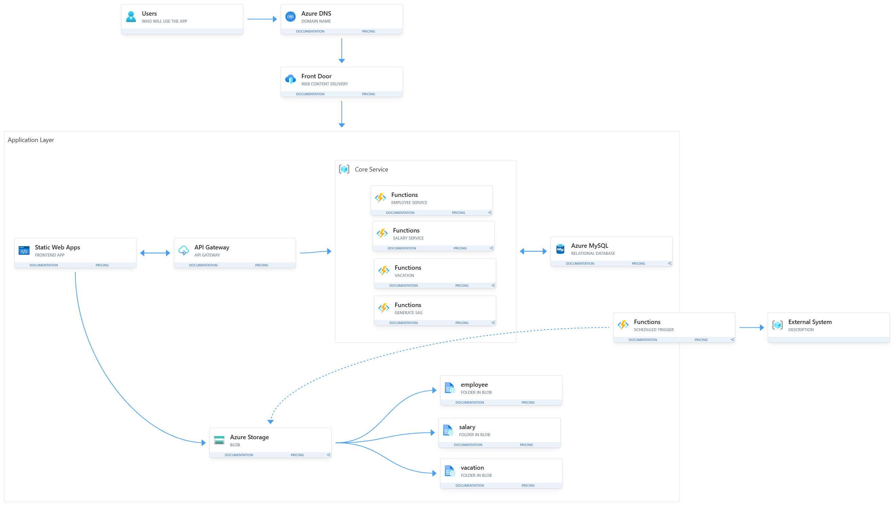

# Case Study - HR System

## Problem Statement

A certain company needs a new HR system for managing its employees, salaries, vacations and payments.

---

## Functional Requirements

**Web-based system** with the following capabilities:

### Employee Management
- Perform CRUD operations on employees
- Support file attachments

### Salary Management
- Allow managers to request employee salary changes
- Allow HR manager to approve or reject salary change requests
- Support file attachments

### Vacation Management
- Manage vacation days
- Support file attachments

### Payment Integration
- Use external payment system

---

## Non-Functional Requirements

- Classic information system
- Not a lot of users
- Not a lot of data
- Interface to external system

---

## External Payment System

- **Technology**: Legacy system written in C
- **Communication**: File-based (input only)
- **Frequency**: Files received once a month

---

---

## Architecture Reasoning

### DNS and Content Delivery
- **DNS** for translating IP addresses to domain names
- **Azure Front Door** for content delivery network to ensure fast access globally. Front Door can cache static assets closer to users, which reduces repeated requests to the origin and improves load times for things like JS, CSS, and images

### API Gateway
**Azure API Management (APIM)**
- Single entry point for all backend services
- Handles routing to different Azure Functions (Employee, Salary, Vacation)
- Provides centralized authentication and authorization
- Rate limiting and throttling to protect backend services
- Request/response transformation if needed
- Monitoring and analytics for API usage

### Backend Services
**Azure Functions (3 separate functions: Employee, Salary, Vacation)**

Why Azure Functions over App Service:
- More cost efficient for this use case
- Pay only when functions are actively running
- Azure Functions includes 1 million free requests per month
- Based on the system specs (not a lot of users), we will likely stay within the free tier
- Even if we exceed 1 million requests, additional requests cost only $0.20 per million
- No charges for idle time

**Tradeoff: Cold Start Latency**
- Azure Functions may experience cold starts (1-3 second delay) after periods of inactivity
- However, this is acceptable for this HR system because:
  - HR operations are administrative tasks, not user-facing real-time features
  - Users typically perform occasional actions (adding an employee, requesting salary changes)
  - A few seconds of delay is acceptable for these infrequent operations
  - HR staff are not expecting instant responses like in a customer-facing application
  - The significant cost savings justify the minor delay

### Database
**Azure SQL Database**
- We are expecting structured data (employees, salaries, vacation records)
- Relational database fits the data model perfectly

### File Upload Strategy
**Optimized file handling approach:**
- Separate backend service generates SAS (Shared Access Signature) tokens
- Frontend uploads files directly to Azure Storage using SAS tokens
- This approach offloads heavy file processing from the backend
- More efficient and scalable than routing files through the backend

### Payment File Export
**Scheduled Azure Function**
- Runs automatically once per month
- Retrieves all necessary payment data for the month
- Generates payment file in the format required by the legacy system
- Uploads file to the external payment system location
