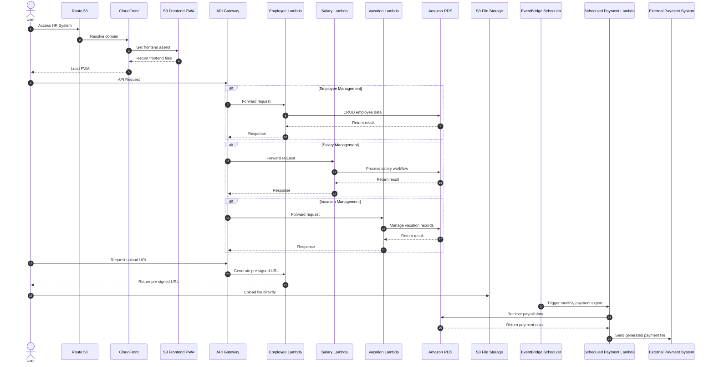

# Case Study - HR System

## Problem Statement

A certain company needs a new HR system for managing its employees, salaries, vacations and payments.

---

## Functional Requirements

**Web-based system** with the following capabilities:

### Employee Management
- Perform CRUD operations on employees
- Support file attachments

### Salary Management
- Allow managers to request employee salary changes
- Allow HR manager to approve or reject salary change requests
- Support file attachments

### Vacation Management
- Manage vacation days
- Support file attachments

### Payment Integration
- Use external payment system

---

## Non-Functional Requirements

- Classic information system
- Not a lot of users
- Not a lot of data
- Interface to external system

---

## External Payment System

- **Technology**: Legacy system written in C
- **Communication**: File-based (input only)
- **Frequency**: Files received once a month

---

---

# Architecture Reasoning

## DNS, TLS, and Content Delivery

### Amazon Route 53
- Manages DNS records for the HR system domain.
- Resolves user requests to CloudFront.

### AWS Certificate Manager (ACM)
- Provides SSL/TLS certificates for HTTPS.
- Secures communication between users and the system.

### Amazon CloudFront
- Serves the frontend PWA from Amazon S3.
- Caches static assets such as:
  - JavaScript
  - CSS
  - Images
  - Documents
- Reduces latency and improves load times by serving content closer to users.

---

## API Layer

### Amazon API Gateway
- Single entry point for all backend APIs.
- Routes requests to the correct Lambda service.
- Can handle:
  - Authentication
  - Authorization
  - Throttling
  - Request validation
  - Monitoring

---

## Backend Services

### AWS Lambda

Separate Lambda functions are used for:
- Employee Management
- Salary Management
- Vacation Management

### Why Lambda?
- Cost efficient for low-traffic systems
- No need to manage servers
- Automatically scales
- Pay only when functions are invoked

### Tradeoff: Cold Starts
- Lambda may have cold start delays after inactivity.
- Acceptable for this HR system because:
  - HR operations are administrative tasks
  - Not customer-facing real-time operations
  - Small delays are acceptable

---

## Networking and Security

### VPC + Private Subnet
- Backend Lambdas run inside a VPC.
- The database is placed in a private subnet.
- The database is not publicly accessible from the internet.
- Only backend services inside the VPC can access the database.

---

## Database

### Amazon RDS
- Relational database fits the HR system data model well.
- Suitable for:
  - Employees
  - Salaries
  - Vacation records
  - Approval workflows
  - Payment records

---

## File Upload Strategy

### Amazon S3
- File attachments are stored in S3 instead of the database.
- Backend generates pre-signed URLs.
- Frontend uploads files directly to S3.

### Benefits
- Reduces backend workload
- Avoids sending large files through Lambda
- More scalable and efficient

---

## Payment File Export

### Scheduled AWS Lambda
- Runs automatically once per month.
- Retrieves payment data from the database.
- Generates payment files required by the legacy external system.
- Uploads or sends the generated file to the external system.

---

# Mermaid Sequence Diagram

